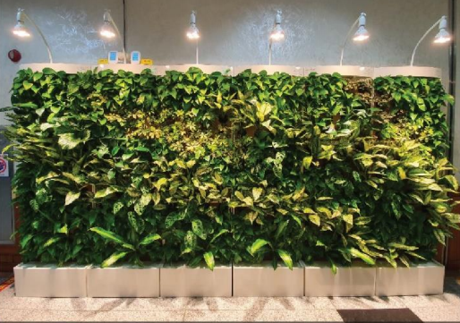
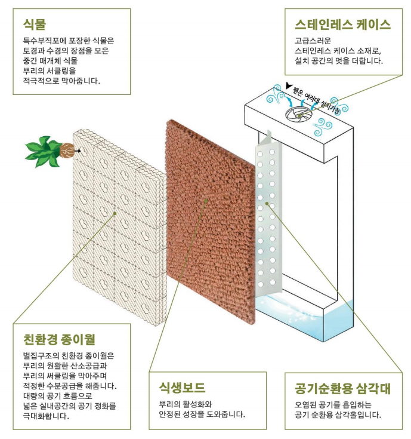
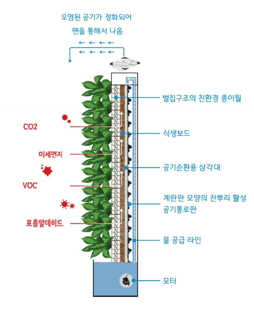
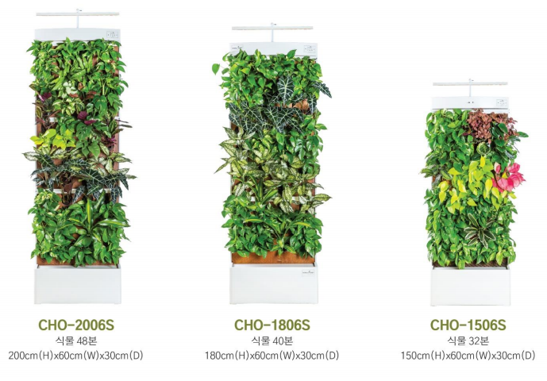
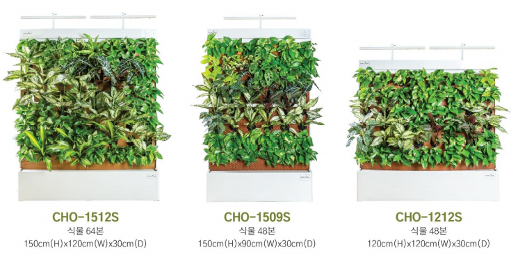

## 우리의 공간은 어떤가요?

미세먼지, 각종 전자파, 생활 소음, 실내 유해 화학물질

온갖 오염에 인간은 스트레스를 받습니다.🥺

그렇기에 요즘 공기정화식물, 친환경 웰빙이 다시 부흥 하고 있습니다.

그러나 식물을 키우고 관리하는 것은 어렵습니다. 어떤 식물이 효과적인지 확인 하는 것 부터,
화분, 흙 등등 관리해야 되는 요소가 너무 많습니다!

💡 바이오월 허니는 이러한 불편함을 해결해 드립니다.

공기 정화 효과, 전자파 차단 효과, 스트레스 감소, 음이온 방출, 온습도를 조절을 하는 자연의 과학을 실현했습니다.

## 바이오월 허니의 장점

- [ ] 큐레이팅 - 각 환경에 따른 최적의 식물 큐레이팅

- [ ] 기술력 - 공기 정화 장치등의 기술력 보유

- [ ] 시스템 - 토경재배, 수경재배의 장점 도입으로 공기 정화 능력 극대화

- [ ] 디자인 - 독특한 식물재배로 인테리어 장점 보유

- [ ] 소재 - 자연 분해 소재로 제품 제작

## 수직으로 이루어진 시스템

수직으로 이루어져 있어 실내에 많은 공간을 차지하지 않습니다.

## 화분보다 7배, 탁월한 공기 정화 능력 🌴

공기청정기 부럽지 않은 탁월한 공기 정화 능력이 있습니다.

- 토양재배, 수경재배, 공기순활을 통합한 특화된 구조
- 화분 7배의 탁월한 공기 정화 능력

### 바이오월 허니의 기술력

- 식물의 뿌리 발달을 극대화한 기술력

- 토양재배와 수경재배 장점 통합

- 뿌리 서클링 방지 기술을 적용한 벌집 구조 종이월

- 뿌리 근원부 습한 공기 투입 시스템

- 식물 전용 LED 조명 설치

- 식물 생육에 최적화된 스펙트럼 적용 전용 조명

- 빛이 부족한 실내환경에서 식물 생육에 필요한 보조광 시스템

### 바이오월 허니의 관리 시스템

1. 최적화된 식물 전용 스펙츠럼 LED 전용

2. 자동급수 및 관수 시스템

3. 팬(fan)을 이용한 공기순환

4. 경량으로 이동 및 재배치 용이

5. 유지 보수 기술 지원 - 식물관리 + 물관리 + 장치관리

## 제품 명세

